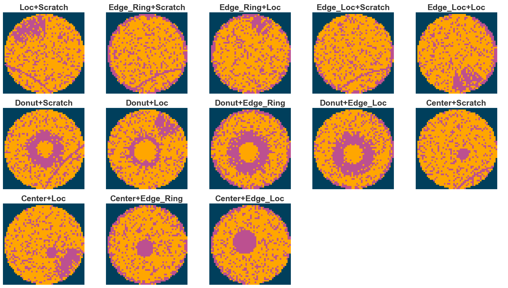
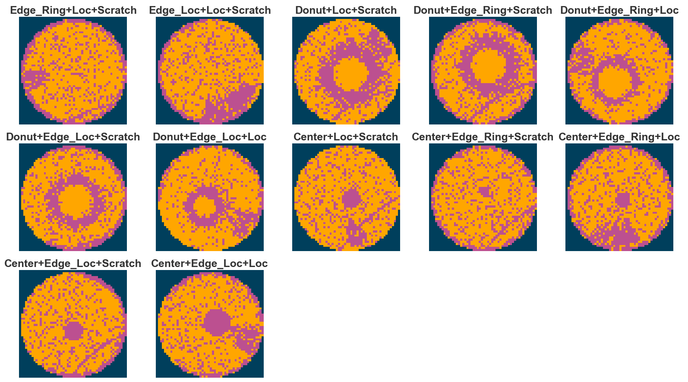
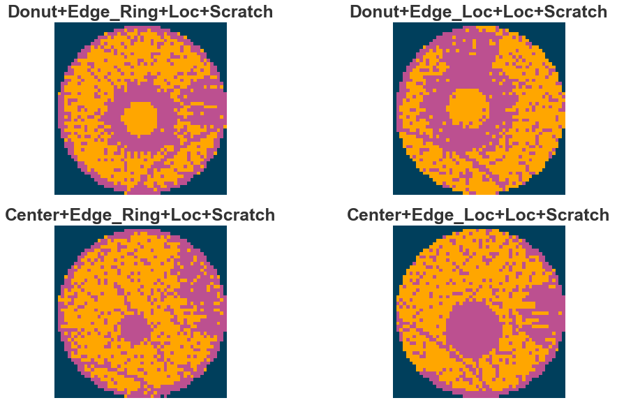
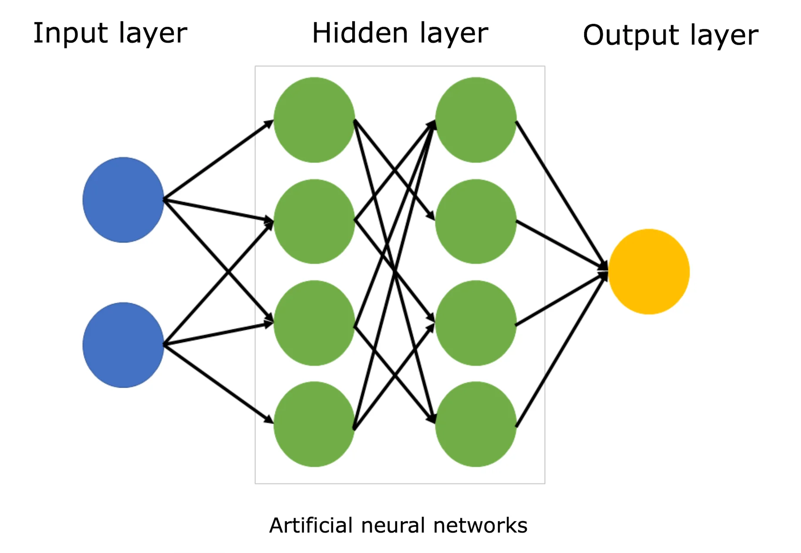
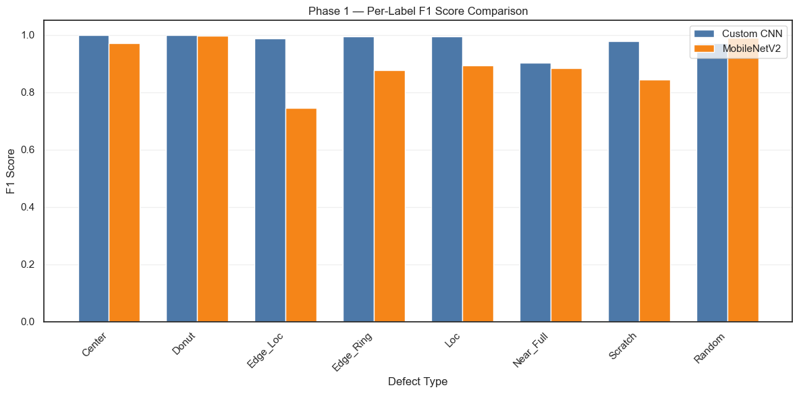
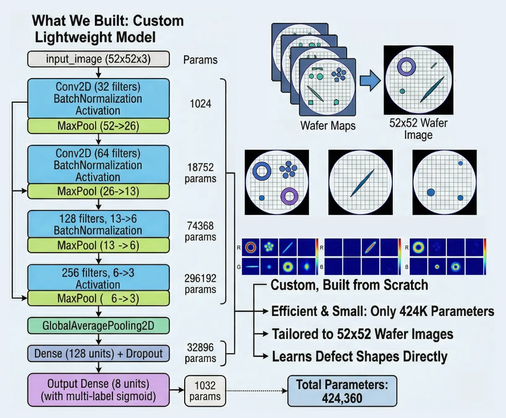
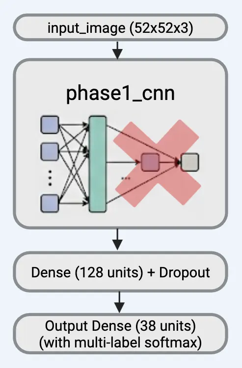

## Agenda

1. **Background**
2. **The Data & Our Model**
3. **The Problem**
4. **Our Solution**
5. **The Business Value**
6. **Live Demo**

## From Silicon to Chips

Semiconductor chips power everything from phones to cars to medical devices. They start as a thin circular slice of silicon called a **wafer**.

<table style="margin: 1.5em auto; border-collapse: separate; border-spacing: 15px 0; font-size: 0.7em;">
<tr>
<td style="background: #4A4A4A; color: white; padding: 25px 20px; border-radius: 8px; text-align: center; width: 200px; vertical-align: middle;">
<strong>Wafer</strong>  A thin, round slice of pure silicon (~12 inches wide)
</td>
<td style="color: #AAAAAA; vertical-align: middle; font-size: 1.5em;">→</td>
<td style="background: #4A4A4A; color: white; padding: 25px 20px; border-radius: 8px; text-align: center; width: 200px; vertical-align: middle;">
<strong>Dies</strong>  Hundreds of tiny chips built onto one wafer each becomes a product
</td>
<td style="color: #AAAAAA; vertical-align: middle; font-size: 1.5em;">→</td>
<td style="background: #4A4A4A; color: white; padding: 25px 20px; border-radius: 8px; text-align: center; width: 200px; vertical-align: middle;">
<strong>Testing</strong>  Each die is electrically tested before being cut and packaged
</td>
<td style="color: #AAAAAA; vertical-align: middle; font-size: 1.5em;">→</td>
<td style="background: #4A4A4A; color: white; padding: 25px 20px; border-radius: 8px; text-align: center; width: 200px; vertical-align: middle;">
<strong>Chips</strong>  Passing dies become finished chips used in phones, cars, etc.
</td>
</tr>
</table>

The percentage of dies that pass testing is called **yield**. Higher yield = lower cost. Defects reduce yield.

## How Wafer Maps Are Generated

After testing, the results are turned into a **wafer map** — a picture of the wafer showing which dies passed and which failed.

:::: {.columns}

::: {.column width="50%"}
Each pixel on the map represents one die:

- **0** = blank (no die at this location)
- **1** = passed electrical test ✓
- **2** = failed electrical test ✗

When many dies fail in a recognizable shape, that's a **defect pattern** — and it usually points to a specific problem in the manufacturing process.
:::

::: {.column width="50%"}

{width="60%" fig-align="center"}

:::

::::

## Defect Patterns Tell a Story

Failed dies don't appear randomly. They form patterns that reveal what went wrong during manufacturing.

:::: {.columns}

::: {.column width="40%"}
Each pattern points to a specific manufacturing process:

- **Donut** → polishing problem (CMP)
- **Center** → deposition chamber issue
- **Scratch** → handling damage
- **Edge Ring** → etching problem

There are **8 base defect types**, and they can appear in **combinations** — giving us **38 total patterns**.
:::

::: {.column width="60%"}

{width="100%" fig-align="center"}

:::

::::

## Single Defect Patterns

{width="90%" fig-align="center"}

## Two-Defect Combinations

{width="90%" fig-align="center"}

## Three-Defect Combinations

{width="90%" fig-align="center"}

## Four-Defect Combinations

{width="90%" fig-align="center"}

## Our Dataset

:::: {.columns}

::: {.column width="50%"}
We worked with a dataset of **38,015 wafer maps** from real semiconductor manufacturing.

- Each image: **52 × 52 pixels**
- **38 unique defect patterns** (8 base + 29 combinations)
- Some patterns are rare (as few as ~200 samples)
- Some are common (~1,000+ samples)

This imbalance reflects real manufacturing — some defects genuinely occur more often than others.
:::

::: {.column width="50%"}

{width="95%" fig-align="center"}

:::

::::

## What is a Neural Network?

:::: {.columns}

::: {.column width="50%"}
Think of it as a **decision-making system** inspired by the brain:

- **Inputs**: Raw data (e.g., pixel values of a wafer image)
- **Hidden layers**: Each layer learns to detect increasingly complex patterns
- **Output**: A prediction (e.g., "this wafer has a scratch defect")

The network **learns by example** — we show it thousands of labeled wafer images, and it figures out what patterns correspond to each defect type.
:::

::: {.column width="50%"}

{width="85%" fig-align="center"}

:::

::::

## How Our AI Model Works

We built a custom CNN model that looks at wafer maps and identifies the defect pattern automatically.

<table style="margin: 1.5em auto; border-collapse: separate; border-spacing: 15px 0; font-size: 0.7em;">
<tr>
<td style="background: #4A4A4A; color: white; padding: 20px 15px; border-radius: 8px; text-align: center; width: 220px; vertical-align: middle;">
<strong>Phase 1</strong>  Model learns to detect the 8 base defect types (Donut, Center, Scratch...)
</td>
<td style="color: #AAAAAA; vertical-align: middle; font-size: 1.5em;">→</td>
<td style="background: #4A4A4A; color: white; padding: 20px 15px; border-radius: 8px; text-align: center; width: 220px; vertical-align: middle;">
<strong>Phase 2</strong>  Uses that knowledge to classify all 38 defect patterns
</td>
<td style="color: #AAAAAA; vertical-align: middle; font-size: 1.5em;">→</td>
<td style="background: #4CAF50; color: white; padding: 20px 15px; border-radius: 8px; text-align: center; width: 220px; vertical-align: middle;">
<strong>Result</strong>  97%+ accuracy Outperformed Google's pre-trained model
</td>
</tr>
</table>

We validated our model by comparing it against **MobileNetV2** — a well-known model from Google trained on millions of images. Our purpose-built model outperformed it on every metric.

{width="70%" fig-align="center"}

## Phase 1: Detecting the 8 Base Defect Types

:::: {.columns}

::: {.column width="50%"}
{width="100%" fig-align="center"}
:::

::: {.column width="50%"}
### Output (Threshold = 50%)
Center = 80% ✅
Edge Ring = 85% ✅
Scratch = 80% ✅
Donut = 30% ❌
Edge Loc = 40% ❌
Loc = 10% ❌
Near Full = 1% ❌
Random = 23% ❌

### How we validated it
- Compared against MobileNetV2 — a model Google trained on millions of images
- If our custom model matches or beats it, we know our approach works
:::

::::

## Phase 2: From 8 Base Types to 38 Defect Patterns

We take our trained Phase 1 model (which learned to detect 8 base defect types) and build on top of it to classify all **38 defect patterns.**

:::: {.columns}

::: {.column width="30%"}

{width="70%" fig-align="center"}

:::

::: {.column width="70%"}

<table style="margin: 2em auto; border-collapse: separate; border-spacing: 30px 0; font-size: 0.75em;">
<tr>
<td style="background: #4A4A4A; color: white; padding: 25px 30px; border-radius: 8px; text-align: center; width: 240px; vertical-align: middle;">
<strong>Transfer learning from Phase 1 Model</strong>  Detects 8 base defect patterns (Center, Donut, Scratch, etc.)
</td>
<td style="color: #AAAAAA; vertical-align: middle; font-size: 2em;">→</td>
<td style="background: #4A4A4A; color: white; padding: 25px 30px; border-radius: 8px; text-align: center; width: 240px; vertical-align: middle;">
<strong>Phase 2 Model</strong>  Classify all 38 defect patterns (base + combinations)
</td>
</tr>
</table>

:::

::::

## How Accuracy is Measured

**Example wafer - Center + Loc + Scratch**

<table style="margin: 1em auto; border-collapse: separate; border-spacing: 0; font-size: 0.65em; width: 95%;">
<tr>
<td style="vertical-align: top; width: 30%; padding: 10px;">

<strong style="font-size: 1.1em;">Phase 1: 8 Yes/No Questions</strong>  
Center → 90% → ✓ Yes 
Donut → 5% → ✗ No 
Edge_Loc → 3% → ✗ No 
Edge_Ring → 2% → ✗ No 
Loc → 95% → ✓ Yes 
Near_Full → 1% → ✗ No 
Scratch → 88% → ✓ Yes 
Random → 4% → ✗ No  
<em>Above 50% = Yes, Below = No</em>

</td>
<td style="text-align: center; vertical-align: middle; color: #AAAAAA; font-size: 1.8em; width: 5%;">→</td>
<td style="vertical-align: top; width: 18%; padding: 10px;">

<strong style="font-size: 1.1em;">Transfer Learning</strong>  
Freeze Phase 1 knowledge  
Pass features to Phase 2

</td>
<td style="text-align: center; vertical-align: middle; color: #AAAAAA; font-size: 1.8em; width: 5%;">→</td>
<td style="vertical-align: top; width: 22%; padding: 10px;">

<strong style="font-size: 1.1em;">Phase 2: Pick Best Match</strong>  
Center — 2% 
Loc+Scratch — 1% 
Center+Loc+Scratch — 97% 
Center+Scratch — 0.5% 
... 34 others &lt;1%  
<em>Highest probability wins</em>

</td>
<td style="text-align: center; vertical-align: middle; color: #AAAAAA; font-size: 1.8em; width: 5%;">→</td>
<td style="vertical-align: top; width: 18%; padding: 10px;">

<strong style="font-size: 1.1em;">Accuracy Check</strong>  
Predicted: <strong>Center+Loc+Scratch</strong>  
Actual: <strong>Center+Loc+Scratch</strong>  
✓ Correct

</td>
</tr>
</table>

- **Phase 1:** Each defect scored independently — above 50% means "present." Accuracy measured per defect type (F1 score)
- **Phase 2:** Picks the single highest-probability pattern out of 38. Correct if it matches the true label
- We repeat this for every wafer in the test set — **97%+ are predicted correctly**

## The Problem

Every day, semiconductor manufacturers produce thousands of wafers. Defects happen. The real challenge isn't finding them — it's knowing **what to do about them**.

<table style="margin: 1.5em auto; border-collapse: separate; border-spacing: 15px 0; font-size: 0.7em;">
<tr>
<td style="background: #4A4A4A; color: white; padding: 25px 20px; border-radius: 8px; text-align: center; width: 280px; vertical-align: middle;">
<strong>Today</strong>  
Engineers analyze defects pattern by pattern  
Weeks to connect defects to root causes  
No clear picture of financial impact
</td>
<td style="color: #AAAAAA; vertical-align: middle; font-size: 2em;">→</td>
<td style="background: #4CAF50; color: white; padding: 25px 20px; border-radius: 8px; text-align: center; width: 280px; vertical-align: middle;">
<strong>With WaferGuardML</strong>  
Automatic defect detection with 97%+ accuracy  
Instant link to the manufacturing process causing it  
Clear cost of inaction and recommended fixes
</td>
</tr>
</table>

## What is WaferGuardML?

<table style="margin: 2em auto; border-collapse: separate; border-spacing: 15px 0; font-size: 0.7em;">
<tr>
<td style="background: #4A4A4A; color: white; padding: 25px 20px; border-radius: 8px; text-align: center; width: 200px; vertical-align: middle;">
<strong>Upload</strong>  Wafer inspection data goes into the system
</td>
<td style="color: #AAAAAA; vertical-align: middle; font-size: 1.5em;">→</td>
<td style="background: #4A4A4A; color: white; padding: 25px 20px; border-radius: 8px; text-align: center; width: 200px; vertical-align: middle;">
<strong>Detect</strong>  AI identifies defect patterns with 97%+ accuracy
</td>
<td style="color: #AAAAAA; vertical-align: middle; font-size: 1.5em;">→</td>
<td style="background: #4A4A4A; color: white; padding: 25px 20px; border-radius: 8px; text-align: center; width: 200px; vertical-align: middle;">
<strong>Diagnose</strong>  Traces each defect to the specific process step
</td>
<td style="color: #AAAAAA; vertical-align: middle; font-size: 1.5em;">→</td>
<td style="background: #4A4A4A; color: white; padding: 25px 20px; border-radius: 8px; text-align: center; width: 200px; vertical-align: middle;">
<strong>Recommend</strong>  Tells you what to fix, what it costs, and what you save
</td>
</tr>
</table>

An end-to-end platform that turns raw wafer data into prioritized, dollar-valued repair recommendations.

## The Key Insight: Fix the Process, Not the Pattern

Most defect analysis tools report results **per defect pattern**. That's useful for engineers, but it doesn't tell the business what to actually do.

**Our approach is different.** We group results by **action** — the manufacturing process step you need to fix.

<table style="margin: 1.5em auto; border-collapse: separate; border-spacing: 30px 0; font-size: 0.7em;">
<tr>
<td style="background: #4A4A4A; color: white; padding: 25px 20px; border-radius: 8px; text-align: center; width: 280px; vertical-align: middle;">
<strong>Old Approach</strong>  
"You have 4,725 wafers with Donut+Edge_Loc+ Loc+Scratch"  
<em style="color: #AAAAAA;">What do I do with that?</em>
</td>
<td style="color: #AAAAAA; vertical-align: middle; font-size: 2em;">→</td>
<td style="background: #4CAF50; color: white; padding: 25px 20px; border-radius: 8px; text-align: center; width: 280px; vertical-align: middle;">
<strong>Our Approach</strong>  
"Replace your CMP pad. Cost: $130K. This fixes Donut defects across 12 patterns. You save $2.1M/month."
</td>
</tr>
</table>

## The Cascade Effect

When you fix one process step, you don't just fix one defect pattern. You fix **every pattern that involves that defect type**.

<table style="margin: 1.5em auto; border-collapse: separate; border-spacing: 0; font-size: 0.65em; width: 90%;">
<tr>
<td style="vertical-align: top; width: 45%; padding: 10px;">

<strong style="font-size: 1.1em;">Fix CMP Process ($130K)</strong>  
✓ Donut (single) 
✓ Donut+Loc 
✓ Donut+Scratch 
✓ Donut+Edge_Loc 
✓ Donut+Edge_Ring 
✓ Donut+Loc+Scratch 
✓ Donut+Edge_Loc+Loc 
✓ Donut+Edge_Loc+Scratch 
✓ Donut+Edge_Ring+Loc 
✓ Donut+Edge_Ring+Scratch 
✓ Donut+Edge_Loc+Loc+Scratch 
✓ Donut+Edge_Ring+Loc+Scratch

</td>
<td style="vertical-align: middle; text-align: center; width: 10%;">
=
</td>
<td style="vertical-align: middle; width: 45%; padding: 10px;">

<strong style="font-size: 1.3em;">12 patterns eliminated</strong>  
One repair, one cost  
<strong style="font-size: 1.5em;">$130K investment</strong> 
vs. millions in avoided losses

</td>
</tr>
</table>

## Live Demo

**Walking through the full WaferGuardML experience**

<table style="margin: 2em auto; border-collapse: separate; border-spacing: 15px 0; font-size: 0.7em;">
<tr>
<td style="background: #4A4A4A; color: white; padding: 20px 15px; border-radius: 8px; text-align: center; width: 200px; vertical-align: middle;">
<strong>Upload</strong>  Wafer batch data
</td>
<td style="color: #AAAAAA; vertical-align: middle; font-size: 1.5em;">→</td>
<td style="background: #4A4A4A; color: white; padding: 20px 15px; border-radius: 8px; text-align: center; width: 200px; vertical-align: middle;">
<strong>Detect</strong>  AI classifies each wafer
</td>
<td style="color: #AAAAAA; vertical-align: middle; font-size: 1.5em;">→</td>
<td style="background: #4A4A4A; color: white; padding: 20px 15px; border-radius: 8px; text-align: center; width: 200px; vertical-align: middle;">
<strong>Analyze</strong>  Financial impact by process action
</td>
<td style="color: #AAAAAA; vertical-align: middle; font-size: 1.5em;">→</td>
<td style="background: #4A4A4A; color: white; padding: 20px 15px; border-radius: 8px; text-align: center; width: 200px; vertical-align: middle;">
<strong>Act</strong>  Prioritized repair recommendations
</td>
</tr>
</table>

*Switching to live demo...*

---

<h2 style="border: none; margin: 0; padding: 0;">Thank You</h2>
 

<strong>Questions?</strong>

---

<h2 style="border: none; margin: 0; padding: 0;">Appendix</h2>

## Wafer Map Generation — Detail {data-visibility="uncounted"}

<table style="margin: 1.5em auto; border-collapse: separate; border-spacing: 15px 0; font-size: 0.7em;">
<tr>
<td style="background: #4A4A4A; color: white; padding: 20px 15px; border-radius: 8px; text-align: center; width: 200px; vertical-align: middle;">
<strong>Fabrication</strong>  Wafer goes through hundreds of process steps (etching, deposition...)
</td>
<td style="color: #AAAAAA; vertical-align: middle; font-size: 1.5em;">→</td>
<td style="background: #4A4A4A; color: white; padding: 20px 15px; border-radius: 8px; text-align: center; width: 200px; vertical-align: middle;">
<strong>Probe Testing</strong>  Probe card contacts each die and measures electrical characteristics
</td>
<td style="color: #AAAAAA; vertical-align: middle; font-size: 1.5em;">→</td>
<td style="background: #4A4A4A; color: white; padding: 20px 15px; border-radius: 8px; text-align: center; width: 200px; vertical-align: middle;">
<strong>Classification</strong>  Each die marked as pass (1), fail (2), or blank (0)
</td>
<td style="color: #AAAAAA; vertical-align: middle; font-size: 1.5em;">→</td>
<td style="background: #4A4A4A; color: white; padding: 20px 15px; border-radius: 8px; text-align: center; width: 200px; vertical-align: middle;">
<strong>Wafer Map</strong>  52×52 grid preserving physical layout of dies on the wafer
</td>
</tr>
</table>

Each pixel in a wafer map is not a color or brightness value — it represents the **electrical test outcome of a single die**. The spatial arrangement reveals defect patterns that point to specific manufacturing problems.

## Dataset Details {.smaller data-visibility="uncounted"}

- **38,015 wafer map images**, each 52×52 pixels
- **3 pixel states:** 0 (blank), 1 (pass), 2 (fail)
- **8 base defect types** that combine into **38 unique patterns**
- Labels use one-hot encoding (8-dimensional vector)
- Data split: 70% train / 15% validation / 15% test (stratified to preserve all 38 patterns)
- Class imbalance handled with focal loss and per-label class weights

| Label | Train | Val | Test |
|-----------|------:|----:|-----:|
| Center | 9,100 | 1,950 | 1,950 |
| Donut | 8,400 | 1,800 | 1,800 |
| Edge_Loc | 9,100 | 1,950 | 1,950 |
| Edge_Ring | 8,400 | 1,800 | 1,800 |
| Loc | 12,600 | 2,700 | 2,700 |
| Near_Full | 104 | 22 | 23 |
| Scratch | 13,300 | 2,850 | 2,850 |
| Random | 606 | 130 | 130 |

## How Our AI Model Works — Detail {data-visibility="uncounted"}

We built a **custom Convolutional Neural Network (CNN)** — a type of AI designed specifically for image recognition.

:::: {.columns}

::: {.column width="50%"}
**Phase 1 (8 base types)**

- 4 layers of filters that learn to detect shapes (edges, rings, clusters)
- Each defect type scored independently (yes/no)
- Above 50% confidence = defect is present
- A wafer can have multiple defects at once
:::

::: {.column width="50%"}
**Phase 2 (38 patterns)**

- Reuses everything Phase 1 learned
- Adds a new layer that picks the exact combination
- Picks the single most likely pattern out of 38
- 97%+ accuracy on unseen test data
:::

::::

We compared our model against **MobileNetV2** (Google's pre-trained model). Our custom model scored higher on every metric, proving that a purpose-built solution outperforms a general one.

## Model Performance {data-visibility="uncounted"}

<table style="font-size: 0.8em; margin: 2em auto;">
<thead>
<tr>
<th></th>
<th>Phase 1 — Custom CNN (8-label)</th>
<th>Phase 1 — MobileNetV2 (8-label)</th>
<th>Phase 2 — Custom CNN (38-class)</th>
<th>Phase 2 — MobileNetV2 (38-class)</th>
</tr>
</thead>
<tbody>
<tr><td><strong>Macro F1</strong></td><td>0.9779</td><td>0.8998</td><td>0.9736</td><td>0.9667</td></tr>
<tr><td><strong>Weighted F1</strong></td><td>0.9905</td><td>0.8847</td><td>0.9735</td><td>0.9658</td></tr>
</tbody>
</table>

F1 score measures how well the model catches real defects without raising false alarms. Our Custom CNN outperformed MobileNetV2 in both phases.

## The 8 Base Defect Types {.smaller data-visibility="uncounted"}

| Defect | Process Step | What Causes It |
|--------|-------------|----------------|
| **Center** | Deposition / Plasma | Chamber contamination, RF/temp drift |
| **Donut** | CMP / Lithography | Worn polishing pad, contaminated slurry |
| **Edge_Loc** | Diffusion / Thermal | Furnace temperature imbalance |
| **Edge_Ring** | Plasma Etch | Worn focus ring, edge hardware issues |
| **Loc** | Tool-specific | Robot vibration, chamber wall contamination |
| **Near_Full** | Major Excursion | Critical process failure, requires immediate stop |
| **Scratch** | Wafer Handling / CMP | Damaged robot end effectors, FOUP contamination |
| **Random** | Environment | Particle contamination, filter degradation |

## Financial Parameters {.smaller data-visibility="uncounted"}

<table style="font-size: 0.65em; margin: 1em auto;">
<thead>
<tr><th>Defect</th><th>Repair Cost</th><th>Replacement Cost</th><th>Downtime/hr</th><th>Yield Loss</th><th>Risk</th></tr>
</thead>
<tbody>
<tr><td>Center</td><td>$275K</td><td>$6.0M</td><td>$2.05M</td><td>10–40%</td><td>High</td></tr>
<tr><td>Donut</td><td>$130K</td><td>$5.25M</td><td>$550K</td><td>15–50%</td><td>High</td></tr>
<tr><td>Edge_Loc</td><td>$110K</td><td>$6.0M</td><td>$550K</td><td>1–10%</td><td>Medium</td></tr>
<tr><td>Edge_Ring</td><td>$255K</td><td>$12.5M</td><td>$2.25M</td><td>0–15%</td><td>High</td></tr>
<tr><td>Loc</td><td>$155K</td><td>$8.5M</td><td>$2.05M</td><td>1–10%</td><td>Medium</td></tr>
<tr><td>Near_Full</td><td>$525K</td><td>$8.5M</td><td>$2.45M</td><td>50–100%</td><td>Critical</td></tr>
<tr><td>Scratch</td><td>$77.5K</td><td>$5.25M</td><td>$550K</td><td>5–50%</td><td>Critical</td></tr>
<tr><td>Random</td><td>$130K</td><td>N/A</td><td>$2.05M</td><td>1–20%</td><td>Medium</td></tr>
</tbody>
</table>

For combination defects, costs are aggregated from components. Repair costs sum, downtime takes the maximum, yield loss compounds.

## How Accuracy is Measured {data-visibility="uncounted"}

**Example wafer: Center + Loc + Scratch**

<table style="margin: 1em auto; border-collapse: separate; border-spacing: 0; font-size: 0.65em; width: 95%;">
<tr>
<td style="vertical-align: top; width: 30%; padding: 10px;">

<strong style="font-size: 1.1em;">Phase 1: 8 Yes/No Questions</strong>  
Center → 90% → ✓ Yes 
Donut → 5% → ✗ No 
Edge_Loc → 3% → ✗ No 
Edge_Ring → 2% → ✗ No 
Loc → 95% → ✓ Yes 
Near_Full → 1% → ✗ No 
Scratch → 88% → ✓ Yes 
Random → 4% → ✗ No  
<em>Above 50% = Yes, Below = No</em>

</td>
<td style="text-align: center; vertical-align: middle; color: #AAAAAA; font-size: 1.8em; width: 5%;">→</td>
<td style="vertical-align: top; width: 18%; padding: 10px;">

<strong style="font-size: 1.1em;">Transfer Learning</strong>  
Freeze Phase 1 knowledge  
Pass features to Phase 2

</td>
<td style="text-align: center; vertical-align: middle; color: #AAAAAA; font-size: 1.8em; width: 5%;">→</td>
<td style="vertical-align: top; width: 22%; padding: 10px;">

<strong style="font-size: 1.1em;">Phase 2: Pick Best Match</strong>  
Center — 2% 
Loc+Scratch — 1% 
Center+Loc+Scratch — 97% 
Center+Scratch — 0.5% 
... 34 others &lt;1%  
<em>Highest probability wins</em>

</td>
<td style="text-align: center; vertical-align: middle; color: #AAAAAA; font-size: 1.8em; width: 5%;">→</td>
<td style="vertical-align: top; width: 18%; padding: 10px;">

<strong style="font-size: 1.1em;">Accuracy Check</strong>  
Predicted: <strong>Center+Loc+Scratch</strong>  
Actual: <strong>Center+Loc+Scratch</strong>  
✓ Correct

</td>
</tr>
</table>

## Use Case: How a Manufacturer Benefits {data-visibility="uncounted"}

<table style="margin: 1.5em auto; border-collapse: separate; border-spacing: 15px 0; font-size: 0.7em;">
<tr>
<td style="background: #4A4A4A; color: white; padding: 20px 15px; border-radius: 8px; text-align: center; width: 200px; vertical-align: middle;">
<strong>Step 1</strong>  Upload batch of wafer inspection data to the dashboard
</td>
<td style="color: #AAAAAA; vertical-align: middle; font-size: 1.5em;">→</td>
<td style="background: #4A4A4A; color: white; padding: 20px 15px; border-radius: 8px; text-align: center; width: 200px; vertical-align: middle;">
<strong>Step 2</strong>  System detects Donut defects trending upward across batches
</td>
<td style="color: #AAAAAA; vertical-align: middle; font-size: 1.5em;">→</td>
<td style="background: #4A4A4A; color: white; padding: 20px 15px; border-radius: 8px; text-align: center; width: 200px; vertical-align: middle;">
<strong>Step 3</strong>  Dashboard shows: CMP process is the root cause
</td>
<td style="color: #AAAAAA; vertical-align: middle; font-size: 1.5em;">→</td>
<td style="background: #4CAF50; color: white; padding: 20px 15px; border-radius: 8px; text-align: center; width: 200px; vertical-align: middle;">
<strong>Step 4</strong>  Recommendation: Replace CMP pad $130K to save $2.1M/mo
</td>
</tr>
</table>

The manufacturer doesn't need to understand defect patterns. They get a clear answer: **what to fix, what it costs, and what they save**.

## Financial Impact by Process Action {data-visibility="uncounted"}

Instead of costs per defect pattern, we show costs per **action the manufacturer can take**:

<table style="font-size: 0.6em; margin: 1em auto;">
<thead>
<tr><th>Action</th><th>Process Step</th><th>Repair Cost</th><th>Patterns Fixed</th><th>Total Daily Savings</th><th>Break-Even</th></tr>
</thead>
<tbody>
<tr><td style="font-weight: bold;">Replace CMP pad + refresh slurry</td><td>CMP / Lithography</td><td>$130K</td><td>12 patterns with Donut</td><td style="color: #4CAF50;">$X</td><td>&lt; 1 day</td></tr>
<tr><td style="font-weight: bold;">Chamber clean + RF recalibration</td><td>Deposition / Plasma</td><td>$275K</td><td>10 patterns with Center</td><td style="color: #4CAF50;">$X</td><td>X days</td></tr>
<tr><td style="font-weight: bold;">Replace focus ring + edge hardware</td><td>Plasma Etch</td><td>$255K</td><td>10 patterns with Edge_Ring</td><td style="color: #4CAF50;">$X</td><td>X days</td></tr>
<tr><td style="font-weight: bold;">Swap/clean robot end effectors</td><td>Wafer Handling</td><td>$77.5K</td><td>12 patterns with Scratch</td><td style="color: #4CAF50;">$X</td><td>&lt; 1 day</td></tr>
<tr><td style="font-weight: bold;">Furnace zone recalibration</td><td>Diffusion / Thermal</td><td>$110K</td><td>10 patterns with Edge_Loc</td><td style="color: #4CAF50;">$X</td><td>X days</td></tr>
</tbody>
</table>

*Daily savings values will be populated from the final app output. "Patterns Fixed" shows how one action cascades across multiple defect combinations.*

## Key Takeaways {data-visibility="uncounted"}

<table style="margin: 2em auto; border-collapse: separate; border-spacing: 15px 0; font-size: 0.7em;">
<tr>
<td style="background: #4A4A4A; color: white; padding: 25px 20px; border-radius: 8px; text-align: center; width: 250px; vertical-align: middle;">
<strong>97%+ Accuracy</strong>  Our AI identifies 38 defect patterns with high confidence
</td>
<td style="background: #4A4A4A; color: white; padding: 25px 20px; border-radius: 8px; text-align: center; width: 250px; vertical-align: middle;">
<strong>Action-Based</strong>  Financial impact grouped by what you can fix, not by defect pattern
</td>
<td style="background: #4A4A4A; color: white; padding: 25px 20px; border-radius: 8px; text-align: center; width: 250px; vertical-align: middle;">
<strong>Cascade Effect</strong>  One process fix eliminates defects across multiple patterns simultaneously
</td>
<td style="background: #4A4A4A; color: white; padding: 25px 20px; border-radius: 8px; text-align: center; width: 250px; vertical-align: middle;">
<strong>Clear ROI</strong>  Every recommendation comes with cost, savings, and break-even time
</td>
</tr>
</table>

WaferGuardML doesn't just tell manufacturers they have a problem. It tells them **exactly what to fix, how much it costs, and how much they save**.

