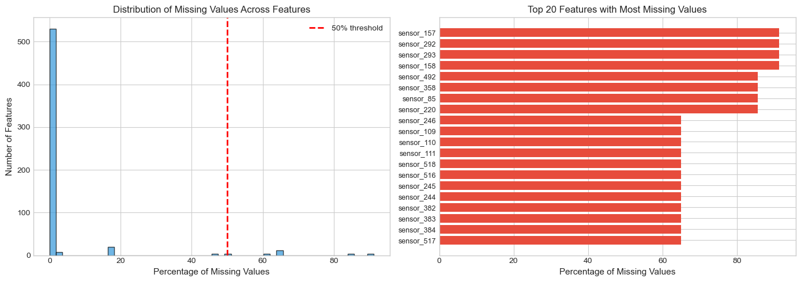
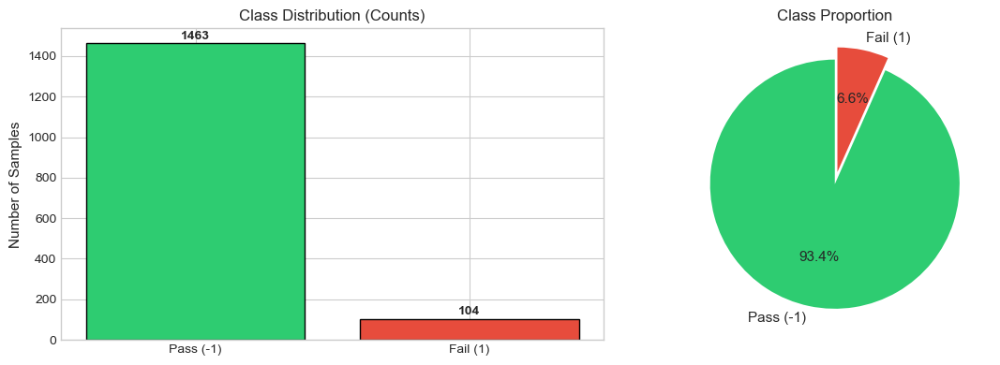
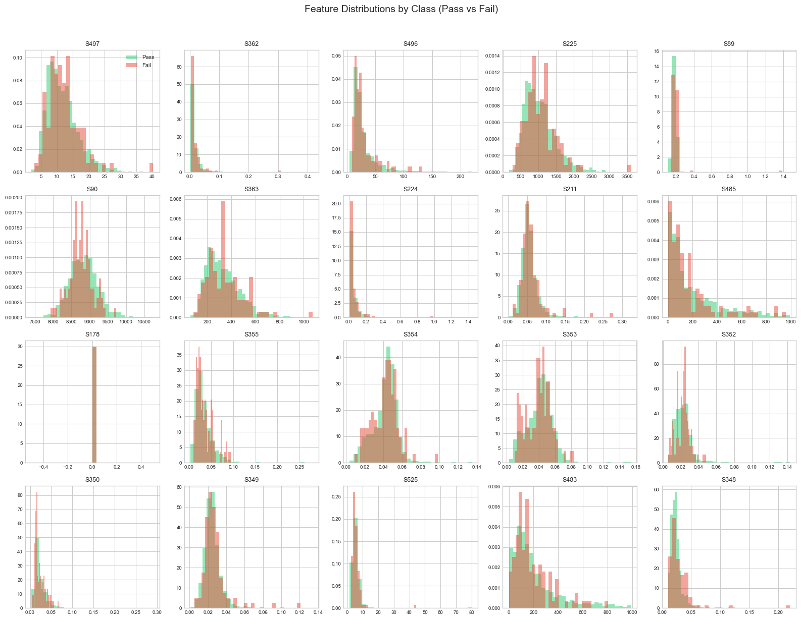
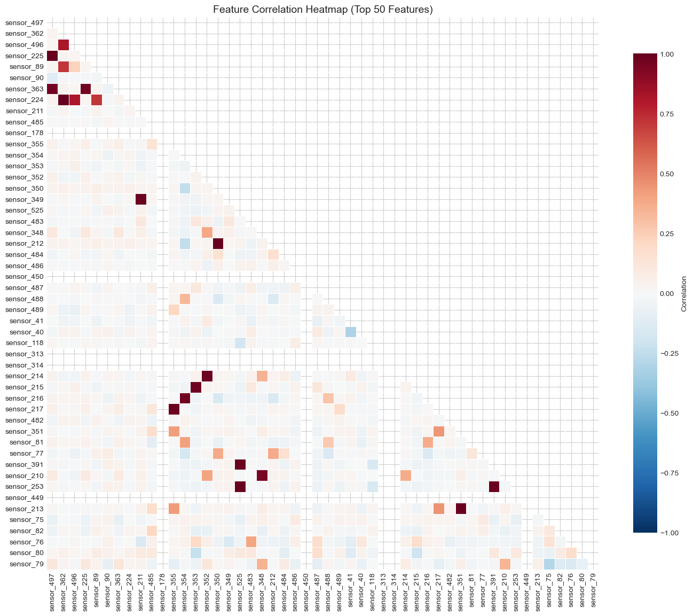
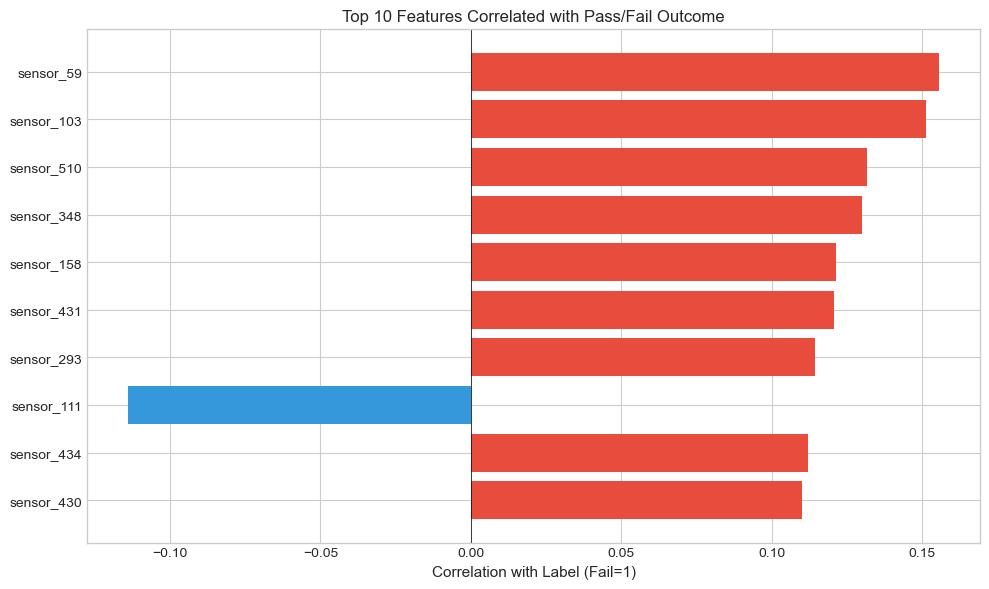
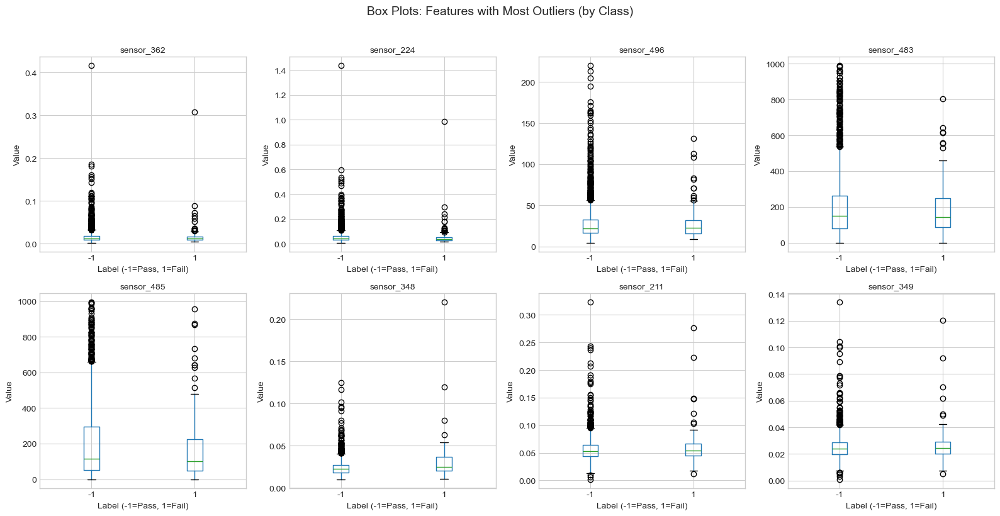

## What is SECOM Data?

Sensor data from a semiconductor manufacturing process.

- **590 sensor measurements** per production entity
- **1,567 samples** (wafers/chips)
- **Binary outcome:** Pass (-1) vs Fail (1)
- **Source:** UCI Machine Learning Repository

::: {.center}
**Real-world sensor data is notoriously "messy" and redundant**
:::

## The Challenge

- High-dimensional sensor data (590 features)
- Severe class imbalance (~93% Pass, ~7% Fail)
- Significant missing values across features
- Many redundant/correlated sensors

## Dataset Overview

| Attribute | Value |
|-----------|-------|
| **Samples** | 1,567 production entities |
| **Features** | 590 sensor measurements |
| **Labels** | Pass (-1) / Fail (1) |
| **Collection Period** | 89 days (Jul-Oct 2008) |

## Missing Value Analysis

{fig-align="center"}

## Missing Value Distribution

- **Features with ANY missing:** 538 out of 590 (91%)
- **Features with >50% missing:** 28 features
- **Average missing per sample:** 26.8 features (4.5%)

::: {.center}
**Strategy:** Drop features with >50% missing; impute the rest
:::

## Descriptive Statistics

{fig-align="center"}

## Constant Features

Some sensors show **zero variance** (useless for prediction).

- Example: `sensor_5` = 100.0 for all samples
- These provide no discriminative power
- Must be identified and removed

## Class Distribution

{fig-align="center"}

## Class Imbalance

The dataset is heavily skewed towards "Pass".

| Class | Label | Frequency |
|-------|-------|-----------|
| Pass  | -1    | ~93%      |
| Fail  | 1     | ~7%       |

::: {.center}
**Risk:** A model predicting "Pass" everywhere achieves 93% accuracy but fails the objective.
:::

## Correlation Analysis

{fig-align="center"}

## Feature Correlations

- Many sensors are highly correlated
- Redundant features increase model complexity
- Strategy: Remove one of each highly correlated pair (|r| > 0.95)

## Additional Analysis

{fig-align="center"}

## Feature Distribution

{fig-align="center"}

## Preprocessing Strategy

1. **Cleaning:**
   - Remove constant features (Zero Variance)
   - Remove high missingness columns (>50%)

2. **Feature Reduction:**
   - Address multicollinearity (|r| > 0.95)
   - Consider PCA

## Handling Imbalance

To enable effective defect detection:

- **Stratified Sampling:** Maintain 7% failure rate in splits
- **SMOTE:** Generate synthetic failure examples
- **Class Weights:** Penalize missing a failure more heavily

## Next Steps

1. Execute preprocessing pipeline
2. Baseline Model Training (Logistic Regression / Random Forest)
3. Evaluate using **Recall** and **F1-Score** (Accuracy is misleading here)

## Dataset Summary

- 1,567 Production Samples
- 590 Sensor Features
- Binary Pass/Fail Labels
- 89 Days of Production Data

## Data Quality Assessment

- ⚠️ Significant Missing Values (91% of features affected)
- ⚠️ Constant Features Present
- ⚠️ Severe Class Imbalance (93/7 split)
- ✅ Preprocessing Pipeline Defined
- ✅ Ready for Model Development
