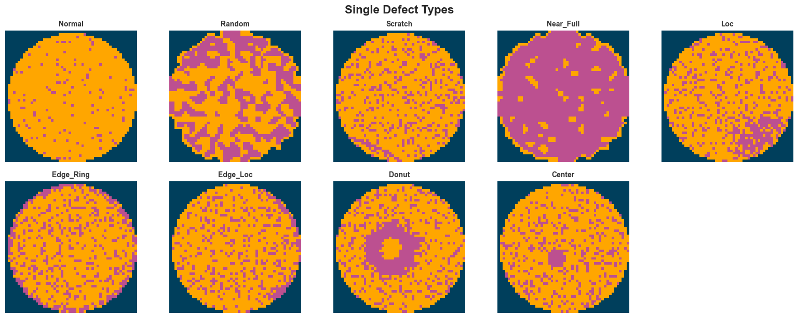
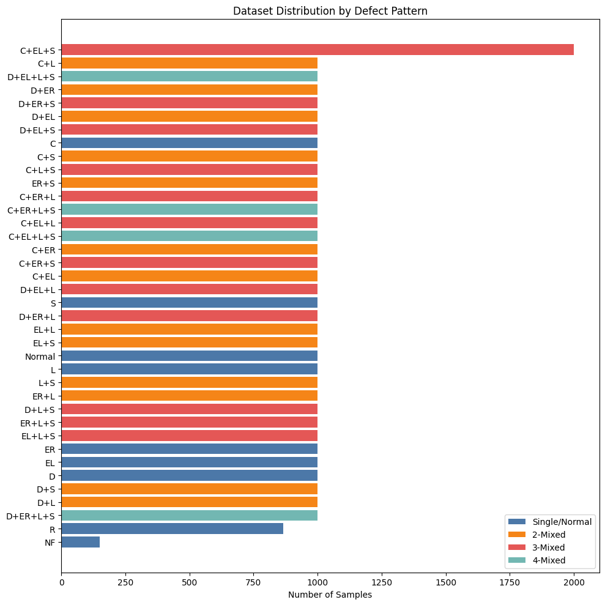
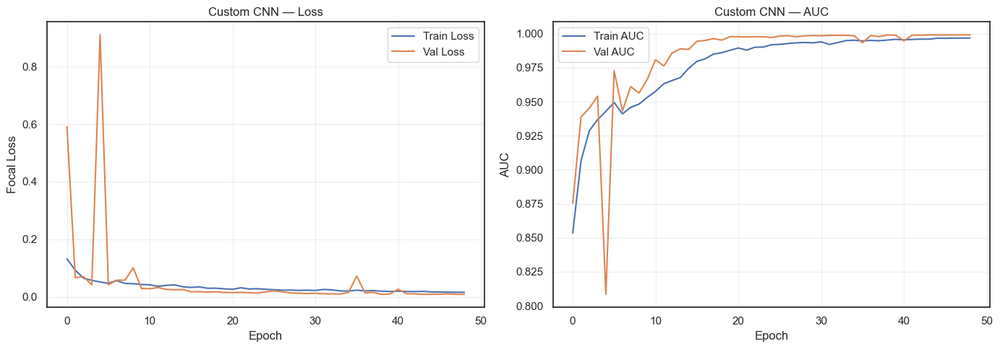
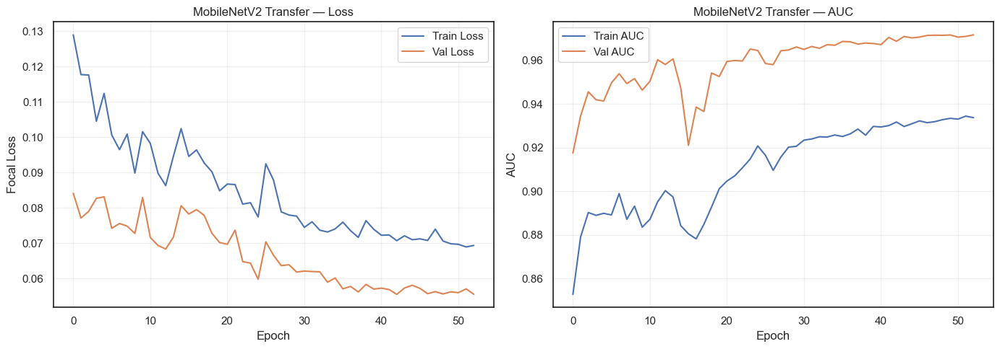
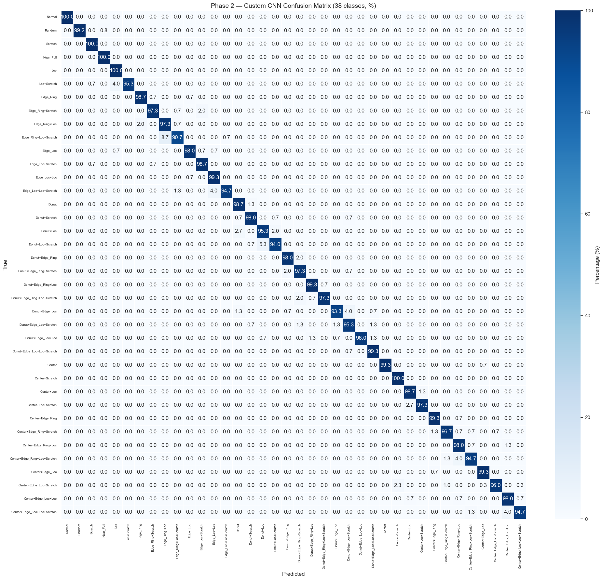
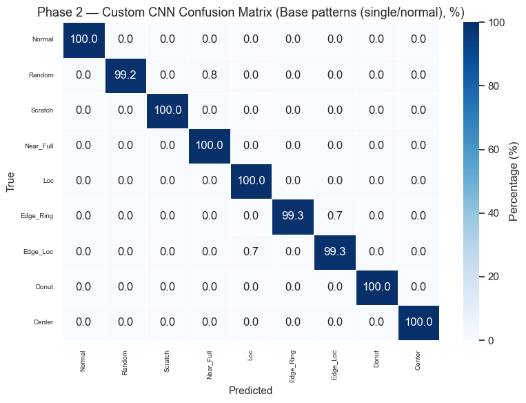
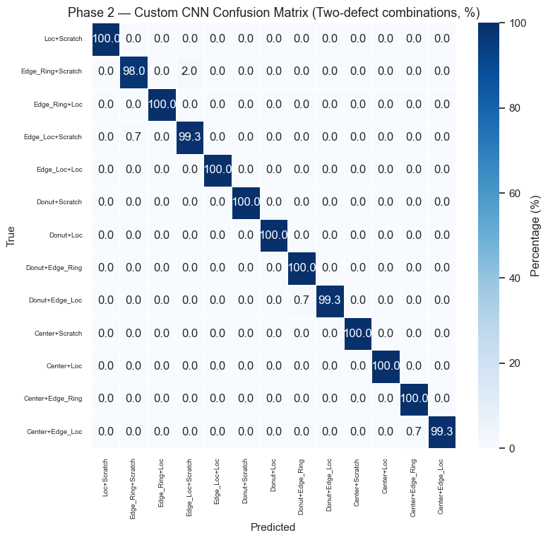
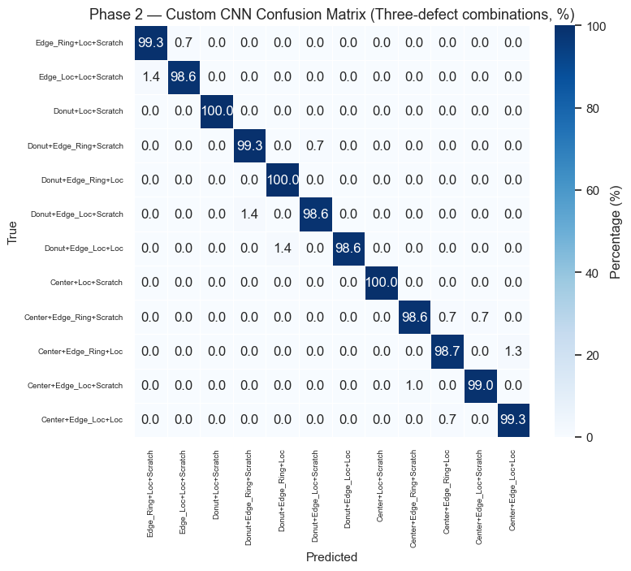
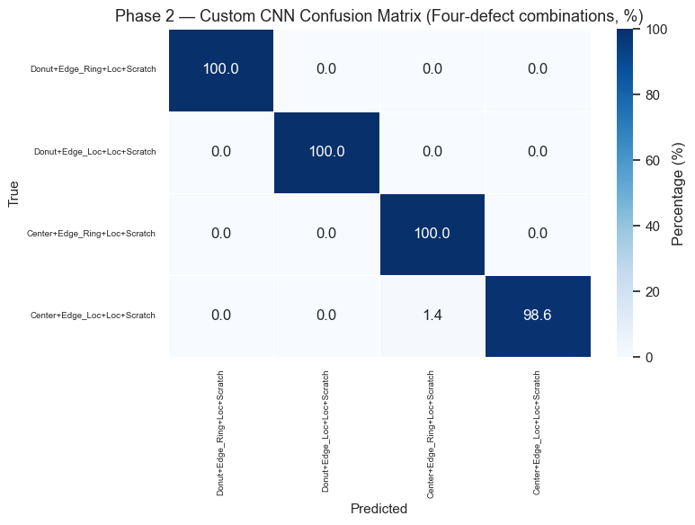

## Agenda

1. **Background** — Why semiconductor defect detection matters
2. **Key Concepts** — Neural networks, CNNs, transfer learning explained
3. **Dataset & Exploration** — The wafer map dataset
4. **Data Preprocessing** — Encoding, splitting, augmentation
5. **Phase 1** — Multi-label classification (8 defect types)
6. **Phase 2** — Multi-class classification (38 defect patterns)
7. **Results & Evaluation**
8. **Visual Representation**

::: {.notes}
Walk through the agenda briefly. Emphasize that the first section is a primer for non-technical audience members.
:::

## Why Semiconductor Defect Detection?

- Semiconductor chips are in **everything** — phones, cars, medical devices
- During manufacturing, silicon **wafers** go through hundreds of process steps
- Defects on the wafer surface cause **chip failures**
- Traditional inspection: **manual review by engineers** — slow, subjective, expensive
- Our goal: **automate defect pattern recognition** using deep learning

**The 8 Base Defect Types**

{width="95%" fig-align="center"}

::: {.notes}
Explain that a wafer is a thin slice of silicon, and each small square on it becomes a chip. Defects = bad chips = money lost.
:::

## What is a Neural Network?

:::: {.columns}

::: {.column width="50%"}
Think of it as a **decision-making system** inspired by the brain:

- **Inputs**: Raw data (e.g., pixel values of a wafer image)
- **Hidden layers**: Each layer learns to detect increasingly complex patterns
- **Output**: A prediction (e.g., "this wafer has a scratch defect")

The network **learns by example** — we show it thousands of labeled wafer images, and it figures out what patterns correspond to each defect type.
:::

::: {.column width="50%"}

{width="85%" fig-align="center"}

:::

::::

## What is a Convolutional Neural Network (CNN)?

A **CNN** is a specialized neural network designed for **images**.

**Key building blocks:**

- **Conv2D layer** — slides small filters across the image to detect features (edges, corners, textures)
- **Pooling layer** — shrinks the image to focus on the most important features
- **Dense layer** — combines all detected features to make the final prediction

**Why CNN for wafer maps?** Defect patterns are *spatial* — a "ring" defect forms a circle, a "scratch" forms a line. CNNs are built to detect exactly these kinds of spatial structures.

## Dataset Overview

:::: {.columns}

::: {.column width="50%"}
**Source:** Mixed-Type Wafer Map Defect Dataset

- **38,015 wafer map images**
- Each image: **52 × 52 pixels**
- **3 pixel states:**
  - `0` = blank (no die)
  - `1` = normal die (passed test)
  - `2` = defective die (failed test)
- Labels: **8-dimensional one-hot vector** (8 base defect types)
- **38 unique defect patterns** (single + combinations)
:::

::: {.column width="50%"}

{width="95%" fig-align="center"}

:::

::::

## Data Preprocessing Pipeline
<table style="margin: 2em auto; border-collapse: separate; border-spacing: 20px 0; font-size: 0.7em;">
<tr>
<td style="background: #4A4A4A; color: white; padding: 20px 25px; border-radius: 8px; text-align: center; width: 160px; vertical-align: middle;">Raw Images 52×52 Values: 0,1,2,3</td>
<td style="color: #AAAAAA; vertical-align: middle; font-size: 1.5em;">→</td>
<td style="background: #4A4A4A; color: white; padding: 20px 25px; border-radius: 8px; text-align: center; width: 160px; vertical-align: middle;">Clean Pixel 3 → 0</td>
<td style="color: #AAAAAA; vertical-align: middle; font-size: 1.5em;">→</td>
<td style="background: #4A4A4A; color: white; padding: 20px 25px; border-radius: 8px; text-align: center; width: 160px; vertical-align: middle;">One-Hot Encode 52×52×3 3 channels</td>
<td style="color: #AAAAAA; vertical-align: middle; font-size: 1.5em;">→</td>
<td style="background: #4A4A4A; color: white; padding: 20px 25px; border-radius: 8px; text-align: center; width: 160px; vertical-align: middle;">Stratified Split 70 / 15 / 15</td>
<td style="color: #AAAAAA; vertical-align: middle; font-size: 1.5em;">→</td>
<td style="background: #4A4A4A; color: white; padding: 20px 25px; border-radius: 8px; text-align: center; width: 160px; vertical-align: middle;">Augmentation Rotation + Flip</td>
</tr>
</table>

::: {.notes}
Why one-hot encode pixels?**
Pixel values 0, 1, 2 are **categorical** (blank, normal, broken) — not ordered intensities. Treating them as numbers (0 < 1 < 2) would imply a false relationship. One-hot encoding gives each state its own channel, preserving the categorical nature.

Why only geometric augmentation?**
Since pixels represent discrete states (not colors), we can only apply **spatial transforms** (90° rotations, flips) that don't alter the categorical values. Color jitter or elastic deformation would corrupt the data.
:::

## Train / Validation / Test Split

:::: {.columns}

::: {.column width="50%"}
**Split ratio:** 70% / 15% / 15%

**Challenge:** With 38 unique label patterns and some having very few samples (~200), a random split could miss entire defect types in the validation or test set.

**Solution: Stratified splitting** — we convert each 8-dim one-hot label to a string key (e.g., `"10100000"` = Center+Edge_Loc) and stratify on these keys. This guarantees **all 38 patterns appear in every split**.
:::

::: {.column width="50%"}
| Split | Samples | Unique Patterns |
|-------|---------|-----------------|
| Train | 26,610 | 38 |
| Val | 5,702 | 38 |
| Test | 5,703 | 38 |

**Per-Label Sample Counts**

| Label | Train | Val | Test |
|-----------|------:|----:|-----:|
| Center | 9,100 | 1,950 | 1,950 |
| Donut | 8,400 | 1,800 | 1,800 |
| Edge_Loc | 9,100 | 1,950 | 1,950 |
| Edge_Ring | 8,400 | 1,800 | 1,800 |
| Loc | 12,600 | 2,700 | 2,700 |
| Near_Full | 104 | 22 | 23 |
| Scratch | 13,300 | 2,850 | 2,850 |
| Random | 606 | 130 | 130 |

:::

::::

## Phase 1: Detecting the 8 Base Defect Types

**Goal:** Look at a wafer map and identify which of the 8 basic defect types are present — a wafer can have more than one at the same time.

:::: {.columns}

::: {.column width="50%"}
### What we built
- Build from scratch
- A lightweight model designed for our 52×52 wafer images
- Learns to recognize defect shapes like rings, scratches, and clusters directly from our data
- Small and efficient — only **424K parameters**
:::

::: {.column width="50%"}
### How we validated it
- Compared against MobileNetV2 — a model Google trained on millions of images
- If our custom model matches or beats it, we know our approach works
:::

::::

## Phase 1 Training Configuration {.smaller}

| Parameter | Value | Why |
|-----------|-------|-----|
| **Loss** | Binary Focal Loss (γ=2.0) | Handles class imbalance |
| **Optimizer** | Adam (lr=1e-3) | Adaptive learning rate, fast convergence |
| **Batch size** | 32 | Balance between stability and speed |
| **Epochs** | Up to 100 | Early stopping will cut short |
| **ReduceLROnPlateau** | patience=5, factor=0.5 | Halves LR when validation plateaus |
| **EarlyStopping** | patience=10 | Stops when no improvement for 10 epochs |
| **Metrics** | AUC + Binary Accuracy | AUC is threshold-independent |

*AUC and Loss Graphs of Custom CNN and MobileNetV2*

:::: {.columns}
::: {.column width="50%"}
{width="95%" fig-align="center"}
:::
::: {.column width="50%"}
{width="95%" fig-align="center"}
:::
::::

## Phase 1 Results

{width="95%" fig-align="center"}

**Key observations to highlight:**

- Both models achieve strong per-label F1 scores
- **Near_Full** is the hardest class (fewest samples ~200)
- Custom CNN and MobileNetV2 each have strengths on different defect types
- The per-label class weights in focal loss successfully boost rare-class performance

## Phase 2: From 8 Base Types to 38 Defect Patterns

We take our trained Phase 1 model (which learned to detect 8 base defect types) and build on top of it to classify all **38 defect patterns.**

<table style="margin: 2em auto; border-collapse: separate; border-spacing: 30px 0; font-size: 0.75em;">
<tr>
<td style="background: #4A4A4A; color: white; padding: 25px 30px; border-radius: 8px; text-align: center; width: 240px; vertical-align: middle;">
<strong>Phase 1 Model</strong>  Detects 8 base defect types (Center, Donut, Scratch, etc.)
</td>
<td style="color: #AAAAAA; vertical-align: middle; font-size: 2em;">→</td>
<td style="background: #4A4A4A; color: white; padding: 25px 30px; border-radius: 8px; text-align: center; width: 240px; vertical-align: middle;">
<strong>Phase 2 Model</strong>  Classifies all 38 patterns (single + combinations)
</td>
</tr>
</table>

- The Phase 1 model already learned **how to read wafer maps** — it knows what edges, clusters, and rings look like
- We **keep that knowledge** and add a new layer that learns to distinguish all 38 specific patterns
- This is more efficient than training a brand new model from scratch — we're building on what's already been learned
- The final model picks the **single most likely pattern** out of 38 for each wafer

## Phase 2 Results — Full Confusion Matrix (38×38)

{width="85%" fig-align="center"}

## Phase 2 Results — Single / Normal Patterns

{width="85%" fig-align="center"}

## Phase 2 Results — Double Combinations

{width="85%" fig-align="center"}

## Phase 2 Results — Triple Combinations

{width="85%" fig-align="center"}

## Phase 2 Results — Quadruple Combinations

{width="85%" fig-align="center"}

## Final Model Comparison

<table style="font-size: 0.8em; margin: 2em auto;">
<thead>
<tr>
<th></th>
<th>Phase 1 — Custom CNN (8-label)</th>
<th>Phase 1 — MobileNetV2 (8-label)</th>
<th>Phase 2 — Custom CNN (38-class)</th>
<th>Phase 2 — MobileNetV2 (38-class)</th>
</tr>
</thead>
<tbody>
<tr><td><strong>Macro F1</strong></td><td>0.9779</td><td>0.8998</td><td>0.9736</td><td>0.9667</td></tr>
<tr><td><strong>Weighted F1</strong></td><td>0.9905</td><td>0.8847</td><td>0.9735</td><td>0.9658</td></tr>
</tbody>
</table>

- Our **Custom CNN outperformed MobileNetV2** in both phases
- The **Phase 2 Custom CNN (38-class)** is our final production model — it can identify all 38 defect patterns with **97%+ accuracy**
- Building our own model from scratch proved more effective than using a pre-trained one for this task

## Live Inference Demo

- Dashboard link

## Summary

**Our Custom CNN Pipeline:**

<table style="margin: 1em auto; border-collapse: separate; border-spacing: 15px 0; font-size: 0.7em;">
<tr>
<td style="background: #4A4A4A; color: white; padding: 20px 15px; border-radius: 8px; text-align: center; width: 180px; vertical-align: middle;">
<strong>Phase 1</strong>  Train our CNN to detect 8 base defect types
</td>
<td style="color: #AAAAAA; vertical-align: middle; font-size: 1.5em;">→</td>
<td style="background: #4A4A4A; color: white; padding: 20px 15px; border-radius: 8px; text-align: center; width: 180px; vertical-align: middle;">
<strong>Phase 2</strong>  Reuse Phase 1 knowledge to classify all 38 patterns
</td>
<td style="color: #AAAAAA; vertical-align: middle; font-size: 1.5em;">→</td>
<td style="background: #4A4A4A; color: white; padding: 20px 15px; border-radius: 8px; text-align: center; width: 180px; vertical-align: middle;">
<strong>Final Model</strong>  38-class Custom CNN 97%+ accuracy
</td>
</tr>
</table>

**Benchmark Comparison:**

<table style="margin: 1em auto; border-collapse: separate; border-spacing: 15px 0; font-size: 0.7em;">
<tr>
<td style="background: #4A4A4A; color: white; padding: 20px 15px; border-radius: 8px; text-align: center; width: 180px; vertical-align: middle;">
<strong>MobileNetV2</strong>  Google's pre-trained model (2.6M params)
</td>
<td style="color: #AAAAAA; vertical-align: middle; font-size: 1.5em;">→</td>
<td style="background: #4A4A4A; color: white; padding: 20px 15px; border-radius: 8px; text-align: center; width: 180px; vertical-align: middle;">
<strong>Same tasks</strong>  Phase 1 (8 types) Phase 2 (38 patterns)
</td>
<td style="color: #AAAAAA; vertical-align: middle; font-size: 1.5em;">→</td>
<td style="background: #4A4A4A; color: white; padding: 20px 15px; border-radius: 8px; text-align: center; width: 180px; vertical-align: middle;">
<strong>Result</strong>  Our CNN outperformed on both phases
</td>
</tr>
</table>

Building our own model from scratch proved more effective than using a pre-trained one for this specialized task.

---

<h2 style="border: none; margin: 0; padding: 0;">Thank You</h2>
 

<strong>Questions?</strong>

---

<h2 style="border: none; margin: 0; padding: 0;">Appendix</h2>

## The 8 Base Defect Types {.smaller data-visibility="uncounted"}

| Defect | Description |
|--------|-------------|
| **Center** | Defects clustered at wafer center |
| **Donut** | Ring-shaped pattern in the middle |
| **Edge_Loc** | Localized defects near the edge |
| **Edge_Ring** | Defects forming a ring at the edge |
| **Loc** | Localized cluster anywhere |
| **Near_Full** | Almost entire wafer is defective |
| **Scratch** | Linear scratch pattern |
| **Random** | Randomly distributed defects |

Plus **Normal** (no defects) and **29 combination patterns** (e.g., Center+Scratch)

{width="95%" fig-align="center"}

## Key Terms {.smaller data-visibility="uncounted"}

:::: {.columns}

::: {.column width="50%"}
### Activation Functions
- **ReLU** — hidden layers; if input > 0 pass through, else 0. Simple and avoids vanishing gradients
- **Sigmoid** — Phase 1 output; squashes to 0–1 per label. Each neuron independently says yes/no
- **Softmax** — Phase 2 output; converts scores to probabilities that sum to 1

### Loss Functions
- **Binary Focal Loss** (Phase 1) — down-weights easy examples, focuses on hard/rare ones
- **Sparse Categorical Crossentropy** (Phase 2) — standard multi-class loss with class weights
:::

::: {.column width="50%"}
### Regularization
- **Batch Normalization** — normalizes layer inputs → faster, more stable training
- **Dropout (0.5)** — randomly silences 50% of neurons → prevents overfitting
- **GlobalAveragePooling2D** — averages each feature map instead of flattening → fewer parameters
- **Early Stopping** — stops training when validation loss plateaus
- **Learning Rate** - How big a step the model takes when updating its weights. Too big = overshooting; too small = too slow.

:::

::::

## What is Transfer Learning? {.smaller data-visibility="uncounted"}

:::: {.columns}

::: {.column width="55%"}
**Transfer learning** means reusing knowledge from one task to improve performance on another.

**Analogy:** Imagine hiring someone who already knows how to identify shapes, edges, and textures, and just teaching them the *specific* wafer defect categories.

**We use transfer learning twice in this project:**

1. **Phase 1 → Phase 2:** First learn to predict the 8 base defect types, then transfer that learned knowledge to predict all 38 defect patterns
2. **MobileNetV2 → Our task:** Reuse a pre-trained model (trained on millions of images) as a feature extractor, and only train a new classification head on top
:::

::: {.column width="45%"}

**Two forms of transfer learning:**

| | From | To |
|---|------|-----|
| **Ours** | Phase 1 (8 types) | Phase 2 (38 patterns) |
| **MobileNetV2** | ImageNet (millions of images) | Wafer defect classification |

:::

::::

## Custom CNN Architecture {.smaller data-visibility="uncounted"}

**Phase 1 Task:** Predict which of the 8 base defect types are present (multi-label, 8 sigmoid outputs)

**Model: custom_cnn — Total params: 424,264 (1.62 MB)**

:::: {.columns}

::: {.column width="50%"}
| Layer | Shape | Params |
|------|------|------:|
| input_image (Input) | (52, 52, 3) | 0 |
| conv2d (Conv2D) | (52, 52, 32) | 896 |
| batch_norm | (52, 52, 32) | 128 |
| activation (ReLU) | (52, 52, 32) | 0 |
| max_pooling2d | (26, 26, 32) | 0 |
| conv2d_1 (Conv2D) | (26, 26, 64) | 18,496 |
| batch_norm_1 | (26, 26, 64) | 256 |
| activation_1 (ReLU) | (26, 26, 64) | 0 |
| max_pooling2d_1 | (13, 13, 64) | 0 |
| conv2d_2 (Conv2D) | (13, 13, 128) | 73,856 |
:::

::: {.column width="50%"}
| Layer | Shape | Params |
|------|------|------:|
| batch_norm_2 | (13, 13, 128) | 512 |
| activation_2 (ReLU) | (13, 13, 128) | 0 |
| max_pooling2d_2 | (6, 6, 128) | 0 |
| conv2d_3 (Conv2D) | (6, 6, 256) | 295,168 |
| batch_norm_3 | (6, 6, 256) | 1,024 |
| activation_3 (ReLU) | (6, 6, 256) | 0 |
| max_pooling2d_3 | (3, 3, 256) | 0 |
| global_avg_pool | (256) | 0 |
| dense (ReLU) | (128) | 32,896 |
| dropout (0.5) | (128) | 0 |
| output (Sigmoid) | (8) | 1,032 |
:::

::::

**Design choices:**

- **Doubling filters (32→256):** Early layers detect simple features (edges), deeper layers detect complex patterns (rings, scratches) — more filters = more capacity for complexity
- **3×3 kernels:** Standard efficient choice — captures local spatial relationships
- **GlobalAveragePooling** over Flatten: reduces parameters from ~2,304 to 256, fighting overfitting

## MobileNetV2 Architecture {data-visibility="uncounted"}

**Model: mobilenet_transfer — Total params: 2,587,988 (9.87 MB)**

| Layer | Output Shape | Params |
|------|-------------|------:|
| input_image (Input) | (52, 52, 3) | 0 |
| conv2d_4 (Conv2D) | (52, 52, 3) | 12 |
| resizing (Resizing) | (224, 224, 3) | 0 |
| mobilenetv2 (Functional) | (7, 7, 1280) | 2,257,984 |
| global_average_pooling2d_1 | (1280) | 0 |
| dense_1 (Dense, ReLU) | (256) | 327,936 |
| dropout_1 (Dropout) | (256) | 0 |
| output (Dense, Sigmoid) | (8) | 2,056 |

**Why MobileNetV2?**

- Pre-trained on ImageNet → already knows edges, textures, shapes
- Lightweight architecture → efficient inference
- **1×1 Conv projection:** Our data has 3 one-hot channels, not RGB — this layer learns the right mapping
- **Frozen backbone:** With only ~38K samples, fine-tuning 2.2M parameters risks overfitting

## Phase 2: Two-Stage Training Details {data-visibility="uncounted"}

**Task:** Classify each wafer into exactly one of 38 defect patterns using **softmax**. We reuse the Phase 1 backbone (frozen) and replace the head with Dense(128) → Dropout → Dense(38, softmax).

<table style="margin: 2em auto; border-collapse: separate; border-spacing: 20px 0; font-size: 0.7em;">
<tr>
<td style="background: #4A4A4A; color: white; padding: 20px 25px; border-radius: 8px; text-align: center; width: 220px; vertical-align: middle;">
<strong>Stage A — Head Only</strong>  Backbone: FROZEN LR: 1e-3 Epochs: ~30 Train new head only
</td>
<td style="color: #AAAAAA; vertical-align: middle; font-size: 1.5em;">→</td>
<td style="background: #4A4A4A; color: white; padding: 20px 25px; border-radius: 8px; text-align: center; width: 220px; vertical-align: middle;">
<strong>Stage B — Fine-Tune</strong>  Backbone: Last 25% UNFROZEN LR: 1e-5 Epochs: ~30 Fine-tune end-to-end
</td>
</tr>
</table>

**Why two stages?**

- **Stage A (head-only):** The new Dense layers have random weights. Training at high LR while backbone is frozen lets them "catch up" without destroying pre-trained weights.
- **Stage B (fine-tune):** Unfreeze the last ~25% of backbone, train at very low LR (1e-5). Adapts features for the 38-class task while preserving prior knowledge.
- **BatchNorm layers stay frozen** — their statistics are from Phase 1 and shouldn't shift.

**Loss:** `sparse_categorical_crossentropy` with **balanced class weights**

## Model Overview {data-visibility="uncounted"}

| Model | Task | Output |
|-------|------|--------|
| Phase 1 — Custom CNN | 8 labels | Sigmoid × 8 |
| Phase 1 — MobileNetV2 | 8 labels | Sigmoid × 8 |
| Phase 2 — Custom CNN | 38 classes | Softmax × 38 |
| Phase 2 — MobileNetV2 | 38 classes | Softmax × 38 |

## Summary {data-visibility="uncounted"}

### What We Built
- A **two-phase deep learning pipeline** for wafer defect classification
- **Phase 1:** Multi-label detection of 8 base defect types
- **Phase 2:** Precise identification of all 38 defect patterns
- Two architectures: **custom CNN** and **MobileNetV2 transfer learning**

## Key Technical Decisions {data-visibility="uncounted"}
- **One-hot pixel encoding** → preserves categorical nature
- **Focal Loss + class weights** → handles severe imbalance
- **Backbone reuse** → leverages Phase 1 knowledge for Phase 2
- **Two-stage fine-tuning** → safe adaptation without catastrophic forgetting
- **Geometric-only augmentation** → respects discrete pixel states
