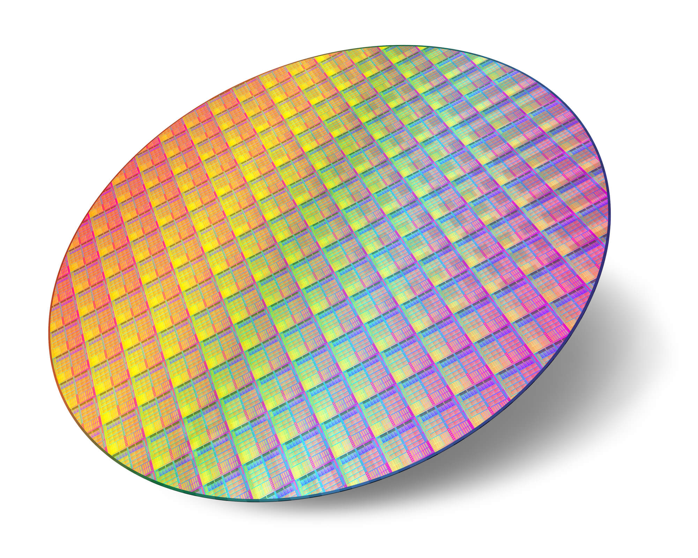
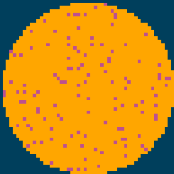
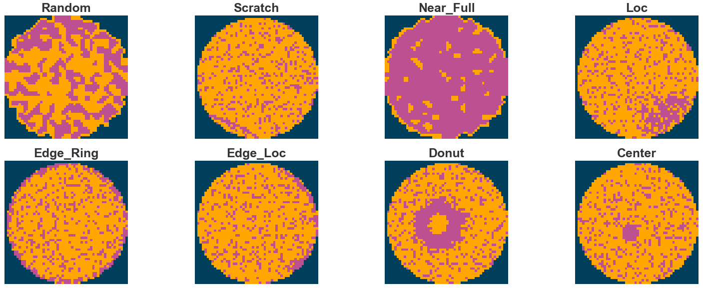
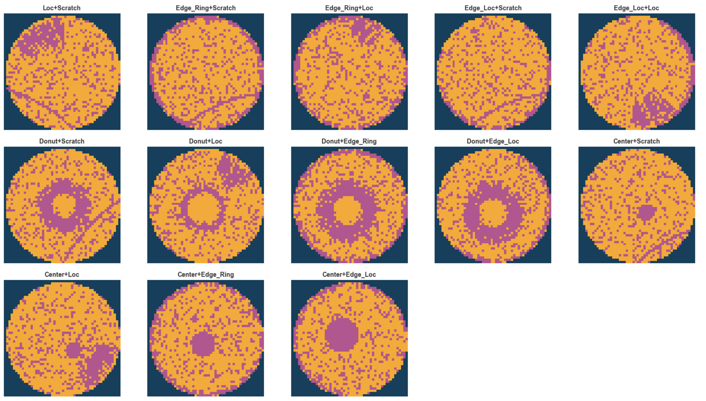
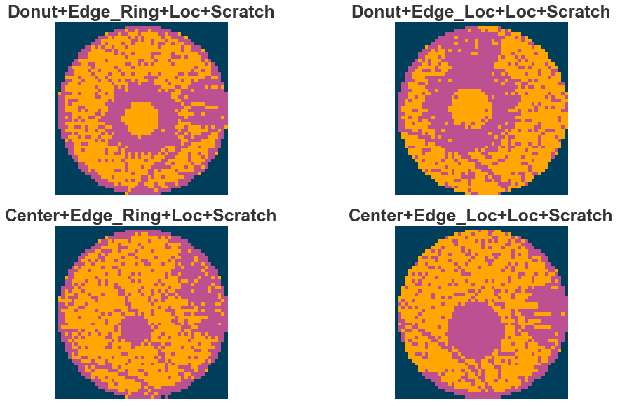
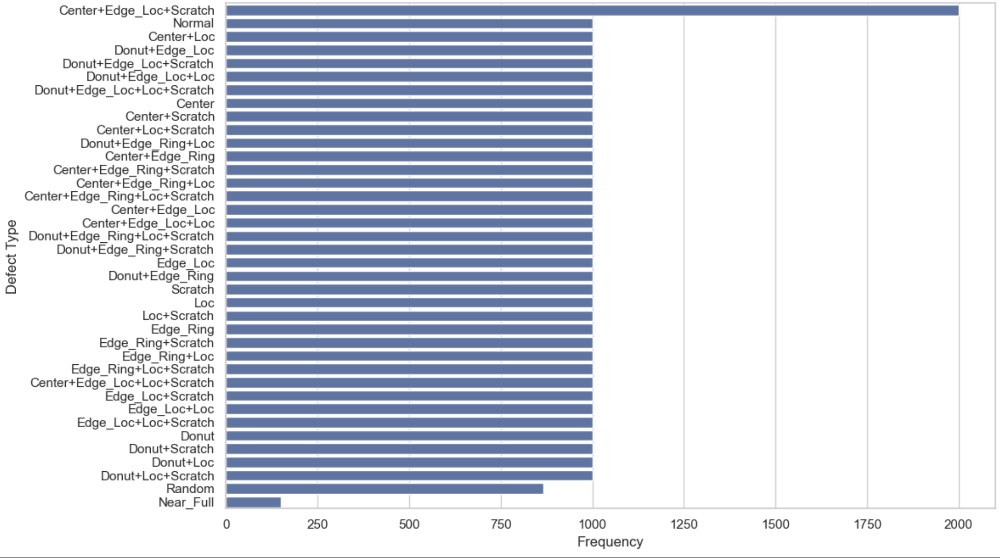

## What is a Semiconductor Wafer?

A semiconductor wafer is a thin, circular slice of silicon used to manufacture computer chips.

:::columns
::: {.column width="50%" layout-valign="center" }
{width=80% fig-align="center"}

:::

::: {.column width="50%"}
- **Thin circular disk** (like a CD, but 12 inches wide)
- **Pure silicon crystal** grown in labs
- **Hundreds** of transistors per mm²
:::
:::
 
:::{.center}
**Silicon wafer = computer chip foundation**
:::

## The Challenge

- Traditional manual inspection is slow and inconsistent
- Defects detected too late in production
- Lost productivity = Millions in yield loss
- Need real-time, automated detection

## Wafer Images Dataset

- The data shape is 52×52.
- 0 means blank spot
- 1 represents normal die that passed the electrical test
- 2 represents broken die that failed the electrical test.
- These wafer maps are obtained by testing the electrical performance of each die on the wafer through test probes.

## Example of a Normal Wafer

{fig-align="center"}

## Defect Patterns

8 distinct defect categories analyzed in our dataset
{fig-align="center"}

## Two Types of Multi-Defect Patterns

{fig-align="center"}

## Three Types of Multi-Defect Patterns
{fig-align="center"}

## Four Types of Multi-Defect Patterns
{fig-align="center"}

## Defect Patter Labels

- The labels in the data are using one-hot encoding, a total of 8 dimensions, corresponding to the 8 basic types of wafer map defects (single defect).
  - Normal: [0, 0, 0, 0, 0, 0, 0, 0]
  - Center: [1, 0, 0, 0, 0, 0, 0, 0]
  - Donut: [0, 1, 0, 0, 0, 0, 0, 0]
  - Edge-Loc: [0, 0, 1, 0, 0, 0, 0, 0]
  - Center-Donut-Edge-Loc: [1, 1, 1, 0, 0, 0, 0, 0]

## Patern Distribution

{fig-align="center"}

## Dataset Summary

- 38K Wafer Maps
- 52x52 Pixel Resolution
- One-Hot Encoded Pattern Labels
- 38 types in the mixed-type wafer map defect dataset
  - 1 normal type
  - 8 single defect types
  - 29 mixed-type (2: 13, 3: 12, 4: 4) defect types.

## Data Quality: Excelent
- No missing values
- Complete Coverage of Defect Types
- Mostly Balanced Classes
- Ready for Modeling
