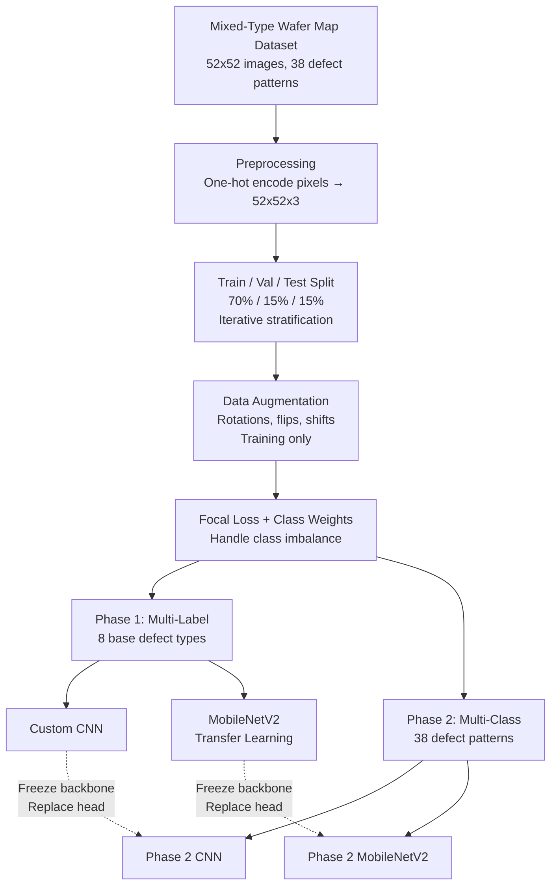
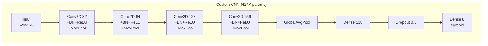
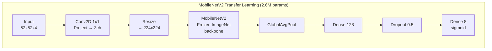
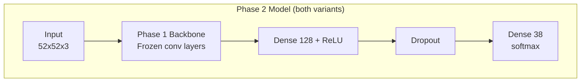

# Wafer Map Defect Classification — Architecture & Model Comparison

## Pipeline Overview

## Model Architectures

### Phase 1 — Multi-Label Classification (8 defect types)

### Phase 2 — Multi-Class Classification (38 patterns)

Reuses Phase 1 convolutional backbones as frozen feature extractors with a new classification head.

**Two-stage training:**
1. **Stage A** — Head-only (backbone frozen), lr=1e-3, ~30 epochs
2. **Stage B** — Unfreeze last 2 conv blocks, fine-tune end-to-end, lr=1e-5, ~30 epochs

## Training Configuration

| Setting | Value |
|---|---|
| Loss (Phase 1) | Binary Focal Loss (gamma=2.0, per-label weights) |
| Loss (Phase 2) | Sparse Categorical Crossentropy + class weights |
| Optimizer | Adam (lr=1e-3) |
| Callbacks | ReduceLROnPlateau (patience=5), EarlyStopping (patience=10) |
| Max Epochs | 100 (Phase 1), 30+30 (Phase 2 stages A+B) |

## Results Comparison

| Model | Macro F1 | Weighted F1 |
|---|---|---|
| **Phase 1 — Custom CNN (8-label)** | **0.9779** | **0.9905** |
| Phase 1 — MobileNetV2 (8-label) | 0.8998 | 0.8847 |
| Phase 2 — Custom CNN (38-class) | 0.9736 | 0.9735 |
| Phase 2 — MobileNetV2 (38-class) | 0.9667 | 0.9658 |

### Phase 1 — Per-Label F1 (8 base defect types)

| Defect Type | Custom CNN | MobileNetV2 |
|---|---|---|
| Center | 1.00 | 0.97 |
| Donut | 1.00 | 1.00 |
| Edge_Loc | 0.99 | 0.75 |
| Edge_Ring | 0.99 | 0.88 |
| Loc | 0.99 | 0.89 |
| Near_Full | 0.90 | 0.88 |
| Scratch | 0.98 | 0.84 |
| Random | 0.97 | 0.99 |

### Key Takeaways

- The **Custom CNN consistently outperforms MobileNetV2** across both phases, likely because wafer map patterns (discrete categorical pixels) differ significantly from natural images that ImageNet features were trained on.
- The lightweight Custom CNN (424K params) beats MobileNetV2 (2.6M params) — **6x fewer parameters, better results**.
- Phase 2 models maintain strong performance when scaling from 8 labels to 38 classes, with the Custom CNN backbone achieving 0.97 Macro F1 on all 38 defect patterns.
